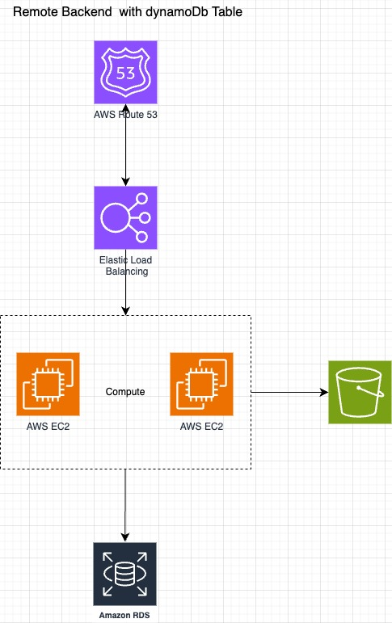

# intro-AWS with terraform

## Lesson 1 : TF Hello World

1. install Terraform
2. authenticate to AWS
   - create user group
   - attach policies to the user group
   - create and add a user to user **group**
   - create key credentianls to new user for aws cli
   - aws configure
   - see credentials at ~/.aws
3. hello world tf config to create a single instance in AWS
4. basic TF commands :
   - Init: download AWS provider code from TF registry into working directory
   - Plan: list the provisioning actions (for add or remove elements) to reach a new state based on the actual state
   - Apply
   - Destroy: total destruction of actual state and configurations associated with the project

## Lesson 2 : State File

- TF representation of the world in a JSON file containing information about every resource and data object,
  the state will contain sensible info, and can be stored locally or remotely.
- **Local Backend**: is easy to start with the state stored locally along side with the project code, but sensible data will keep in plain text format, also is highly uncollaborative, and modifications are strictly manual -**Remote Backend**: store the state remotely, one option is to use TF Cloud or self managed backend like AWS S3 bucket, or dynamoDB table (for locking and prevent multiple changes in the state at the same time), remote backend enable sensitive data encryption, collaboration with others team members and make automation possible (CI-CD pipelines integration for example). but also increase the complexity of development process
- to use remote backend first define local backend, and then define the needed resource to provide the remote backend

### Remote Backend Example App

- Backend and provider config
- EC2 instances
- S3 buckets
- VPC and subnets
- security groups and rules
- application load balancer
  - ALB target group and attachment
- Route 53 zone and record
- RDS instance

**Architecture**

